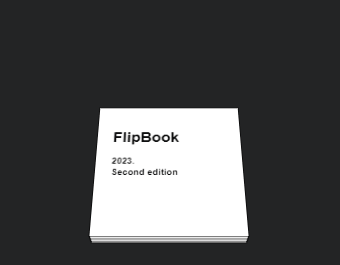

# FlipBook

Simple CSS-driven 3D flip-book



## Tips

- Edit the page "thicnkess" by setting the desired `.page`'s `--z` value.  
- To dynamically open a desired page via JavaScript change the *current* `--c` CSS var like:
    ```js
    elBook.style.setProperty("--c", index);
    ```

Stack Overflow answer: [Create a flip-book using CSS and JS](https://stackoverflow.com/a/76978444/383904)

## Current Features

- [x] Smooth CSS3 transition
- [x] Multiple pages flip animation
- [x] Click page to flip
- [ ] Drag page to flip
- [ ] Component Class
- [ ] Switch 3D / top-down view
- [ ] Dynamic pages Z (thickness)
- [ ] Better shadows
- [ ] Paper flip distortion


___

## Licence

[MIT](./LICENSE)
